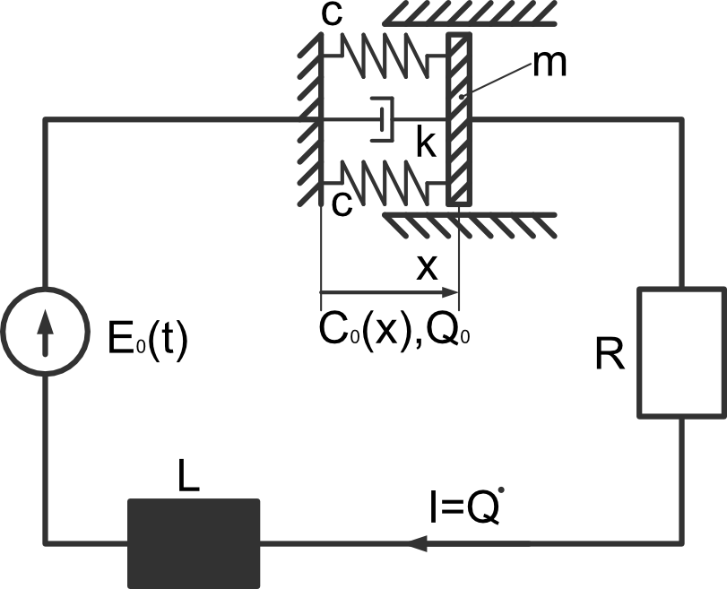

Mechatronics: solving of systems of ODEs II
-------------------------------------------

- given:
    - :math:`t` - time
    - :math:`x(t)` - position of the movable side of the capacitor
    - :math:`Q(t)` - electrical charge
    - :math:`Q_0` - initial electrical charge
    - :math:`R` - resistor
    - :math:`L` - coil (inductor)
    - :math:`I` - current
    - :math:`C(x(t))` - capacitance
    - :math:`E_0(t)` - gravitational acceleration
    - :math:`m` - point mass at the end of the pendulum
    - :math:`c` - spring stiffness
    - :math:`k` - damping factor
    - :math:`^{\cdot}` - derivative with respect to time

- wanted:
    - Equation of motion using Lagrange equation of second kind
    - Optional: plot of the displacement of the movable side of the capacitor

- procedure:
    - define symbols and functions
    - get kinetic energy
    - get potential energy
    - get dissipation function
    - get applied forces
    - define Lagrangian
    - apply formalism to get Euler-Lagrange equation / equation of motion
        - :math:`\frac{d}{dt}\left( \frac{\partial L}{\partial \dot{q}(t)}\right) - \frac{\partial L}{\partial q(t)} = -\frac{\partial d}{\partial \dot{q}(t)} + F \frac{\partial r_f}{\partial q(t)}`
    - Optional: solve the equation of motion using **scipy.odeint()** considering ICS and :math:`t \in {0..20}` s

- **pseudo-code**:

.. note::

    Do this task inside a jupyter notebook!

.. code-block::

    clear variables

    import sympy as sp
    import ...

    # define symbols
    ..., ..., ... = sp.symbols(...)

    # define the components of the Lagrangian
    T = ... # kinetic energy
    U = ... # potential energy
    d = ... # dissipation function
    F = ... # general forces

    # calculate the Lagrangian
    L = T-U

    # apply the formalism
    EoMo1 = ...

    EoMo2 = ...

    # substitute values (optional)
    EoMo1 = EoMo1.subs([(..,..),(..,..)...])
    ...

    # define lambda function (optional)
    fun1 =  sp.lambdify(...)
    fun2 =  sp.lambdify(...)

    # Setup system of ordinary differential equations of first order
    # in order to solve the ordinary differential equations of second order (optional)

    def ode_sys(...):
        ...
        return

    # Solve the IVP (optional)
    from scipy.integrate import odeint
    sol = odeint(odesys, iniVal, t,...)

    # plot results
    ....
