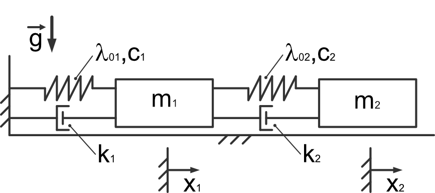

Dynamics: solving of systems of ODEs III
----------------------------------------

Connected mass points inspired by `SciPy CookBook <https://scipy-cookbook.readthedocs.io/items/CoupledSpringMassSystem.html>`_ .

- given:
    - :math:`t\in [0..10]s` - time
    - :math:`x_1(t)` - position of the first mass point
    - :math:`x_2(t)` - position of the second mass point
    - :math:`m_1 = 1 kg` - mass 1
    - :math:`m_2 = 1.5 kg` - mass 2
    - :math:`c_1 = 8 \frac{N}{m}` - spring stiffness 1
    - :math:`c_2 = 40 \frac{N}{m}` - spring stiffness 2
    - :math:`\lambda_{01} = 0.5 m` - initial length of spring 1
    - :math:`\lambda_{02} = 1 m` - initial length of spring 2
    - :math:`k_1 = 0.8 \frac{N s}{m}` - damping factor 1
    - :math:`k_2 = 0.5 \frac{N s}{m}` - damping factor 2
    - :math:`^{\cdot}` - derivative with respect to time

    - ICS: :math:`x_1(0) = 0.5 m;  \dot{x}_1(0) = 0 \frac{m}{s}; x_2(0) = 2.25 m;  \dot{x}_2(0) = 0 \frac{m}{s}`
- wanted:
    - Equation of motion using Lagrange equation of second kind
    - solve the ODE system using **scipy.odeint()** and **scipy.solve_ivp**

- procedure:
    - define symbols and functions
    - get kinetic energy
    - get potential energy
    - get dissipation function
    - get applied forces
    - define Lagrangian
    - apply formalism to get Euler-Lagrange equation / equation of motion
        - :math:`\frac{d}{dt}\left( \frac{\partial L}{\partial \dot{q}(t)}\right) - \frac{\partial L}{\partial q(t)} = -\frac{\partial d}{\partial \dot{q}(t)} + F \frac{\partial r_f}{\partial q(t)}`

- **pseudo-code**:

.. note::

    Do this task inside a jupyter notebook!

.. code-block::

    clear variables

    import sympy as sp
    import ...

    # define symbols
    ..., ..., ... = sp.symbols(...)

    # define the components of the Lagrangian
    T = ... # kinetic energy
    U = ... # potential energy
    d = ... # dissipation function
    F = ... # general forces

    # calculate the Lagrangian
    L = T-U

    # apply the formalism
    EoMo1 = ...

    EoMo2 = ...

    # substitute values (optional)
    EoMo1 = EoMo1.subs([(..,..),(..,..)...])
    ...

    # define lambda function (optional)
    fun1 =  sp.lambdify(...)
    fun2 =  sp.lambdify(...)

    # Setup system of ordinary differential equations of first order
    # in order to solve the ordinary differential equations of second order (optional)

    def ode_sys(...):
        ...
        return

    # Solve the IVP (optional)
    from scipy.integrate import odeint, solve_ivp
    sol = odeint(odesys, iniVal, t,...)

    # plot results
    ....

.. raw:: html
    :file: E11.html