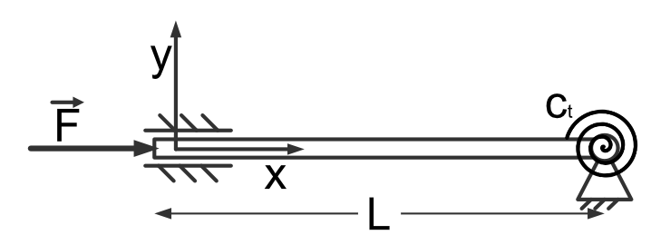

Statics: solving of eigenvalue problems
---------------------------------------

E6.a - Task
***********
.. image:: _static/E6_a.png
    :width: 400
    :alt: Bar with joint and different loads.

- given:
    - :math:`E, I_z, l`
- wanted:
    - the force :math:`F_{bck}` that causes buckling of the given rod
    - compare your results to the corresponding Euler case

- procedure:
    - get the support reactions (deformed state)
    - get the internal force components (deformed state)
    - define the deformation equations using: :math:`\frac{d^2v}{dx^2} = \frac{M_{bz(x)}}{E\,I_z}`
    - solve the deformation equations using **sympy.dsolve**
    - set up a system of nonlinear equations using the corresponding boundary conditions
    - determine the force corresponding to first buckling mode (:math:`F_{bck}`)

- **pseudo-code**:

.. note::

    Do this task inside a jupyter notebook!

.. code-block::

    clear variables

    import sympy as sp
    import ...

    # define symbols
    ..., ..., ... = sp.symbols(...)

    # determine support reactions
    ... = sp.Eq(..., ...)

    # determine internal force equilibrium
    ... = sp.Eq(..., ...)

    # Definition of the deformation equation
    ... = sp.Eq(sp.Derivative(..., ...), ...)

    # Solution of the ODE without BC
    ... = sp.dsolve(..., ...)

    # Set up system of nonlinear equations using the BC
    ... = sp.Eq(..., ...)

    # Solve the system of nonlinear equations
    CoeffMat = sp.Matrix([[example.rhs.coeff('C1') ...)
    EVE = sp.Eq(0, Coef.Mat.det())

    EVE = sp.lambdiy(... EVE(F) ...)

    # Plot EVE
    plt.plot(F, EVE(F)

    # Solve EVE
    from scipy.optimize import fsolve
    sol = fsolve(... EVE(F))

E6.b - Task
***********

- given:
    - :math:`L, c_t, E, I_z`
- wanted:
    - the force :math:`F_{bck}` that causes buckling of the given rod
- procedure:
    - get the support reactions (deformed state)
    - get the internal force components (deformed state)
    - define the deformation equation using: :math:`\frac{d^2v}{dx^2} = \frac{M_{bz(x)}}{E\,I_z}`
    - solve the deformation equation using **sympy.dsolve**
    - set up a system of nonlinear equations using the corresponding boundary conditions
    - determine the force corresponding to first buckling mode (:math:`F_{bck}`)

- **pseudo-code**:

.. note::

    Do this task inside a jupyter notebook!

.. code-block::

    clear variables

    import sympy as sp
    import ...

    # define symbols
    ..., ..., ... = sp.symbols(...)

    # determine support reactions
    ... = sp.Eq(..., ...)

    # determine internal force equilibrium
    ... = sp.Eq(..., ...)

    # Definition of the deformation equation
    ... = sp.Eq(sp.Derivative(..., ...), ...)

    # Solution of the ODE without BC
    ... = sp.dsolve(..., ...)

    # Set up system of nonlinear equations using the BC
    ... = sp.Eq(..., ...)

    # Solve the system of nonlinear equations
    CoeffMat = sp.Matrix([[example.rhs.coeff('C1') ...)
    EVE = sp.Eq(0, Coef.Mat.det())

    EVE = sp.lambdiy(... EVE(F) ...)

    # Plot EVE
    plt.plot(F, EVE(F)

    # Solve EVE
    from scipy.optimize import fsolve
    sol = fsolve(... EVE(F))

