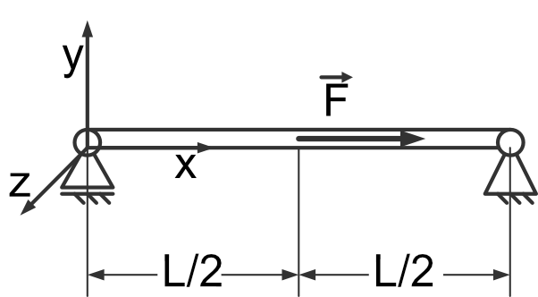

Statics: solving of eigenvalue problems
---------------------------------------

- given:
    - :math:`F, a, q_0, \alpha`
- wanted:
    - ...

.. image:: _static/E6_b.png
    :width: 400
    :alt: Bar with joint and different loads.

- given:
    - :math:`F, a, q_0, \alpha`
- wanted:
    - ...